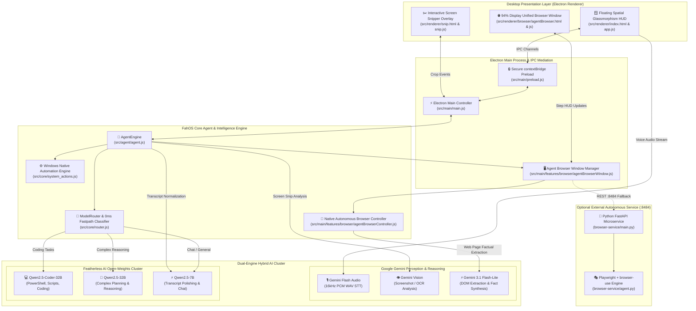
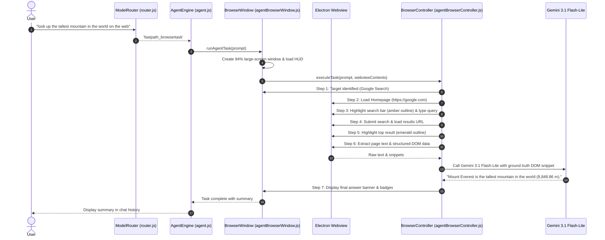

# FahOS — System Architecture & Technical Blueprint

This document provides a comprehensive technical breakdown of the architecture, design patterns, component interactions, and data flows within **FahOS** (AI Operating Layer for Windows).

---

## 🏛️ 1. High-Level Architecture Topology

FahOS is structured as a layered desktop operating agent built on **Electron**, fusing a **Dual-Engine AI Cluster** (Google Gemini + Featherless AI Qwen 2.5) with native **Windows System Automation** and an **Autonomous Large-Screen Unified Browser Engine**.



---

## 🧩 2. Core Subsystems

### 2.1 The Floating Spatial HUD (`src/renderer/`)
- **Glassmorphism Architecture**: Transparent, frameless window with backdrop blurs (`rgba(13, 15, 23, 0.78)`), gold accent rings, and smooth hardware-accelerated CSS transitions.
- **Vertical-Only Lock**: Custom drag and resize handles restrict expansion to the vertical axis only, ensuring the window never accidentally widens horizontally.
- **Collapsible History Stream**: Multi-line responses or text exceeding 130 characters render inside clean 72px cards with a bottom fade mask and interactive **Show More ▾** / **Show Less ▴** toggles.

### 2.2 Model Router & Intent Classifier (`src/core/router.js`)
The `ModelRouter` evaluates user prompts through an ordered, deterministic fast-path decision tree before escalating to remote LLM calls:

```
[ Incoming Prompt ]
        │
        ├─► Image attached or explicit screen reference? ──► 'vision' (Gemini Vision)
        ├─► Windows command syntax (whoami, dir, ipconfig)? ──► 'fastpath_cmd' (Native Shell)
        ├─► Media controls (volume up/down, mute, pause)? ──► 'fastpath_media' (Native Audio)
        ├─► Local Spotify play / search? ──────────────► 'fastpath_spotify' (Spotify URI)
        ├─► Autonomous Web Browser Signals? ───────────► 'fastpath_browsertask' (Unified Browser)
        │     ├─ youtube / yt search or play
        │     ├─ google / web lookups
        │     ├─ wikipedia summaries
        │     ├─ amazon product queries
        │     ├─ github repository searches
        │     └─ reddit discussion lookups
        ├─► Informational query (tell me, what is)? ──► Model Dispatch (Qwen2.5 Cluster)
        ├─► Notepad quick note? ──────────────────────► 'fastpath_note' (Local Notepad)
        ├─► WhatsApp message? ────────────────────────► 'fastpath_whatsapp' (WhatsApp Desktop)
        ├─► File / folder create? ────────────────────► 'fastpath_create' (Filesystem)
        ├─► File / folder safe delete? ──────────────► 'fastpath_delete' (Recycle Bin)
        ├─► App lifecycle (close / open)? ────────────► 'fastpath_close' / 'fastpath_app'
        └─► Coding / Scripting keywords? ─────────────► 'coding' (Qwen2.5-Coder-32B)
```

---

## 🌐 3. Autonomous Large-Screen Unified Browser Engine

FahOS provides a native autonomous web browsing experience that operates inside a dedicated **94% viewport desktop window** rather than opening standard external browsers.

### 3.1 Browser Window Specifications
- **Viewport Size**: 94% display width, 92% display height (up to 1520×960px) for maximum visibility.
- **Live Step HUD**: Floating frosted glass banner showing:
  - Dynamic Platform / Domain Badge (e.g. `GOOGLE.COM`, `YOUTUBE.COM`, `WIKIPEDIA.ORG`, `AMAZON.IN`).
  - Model Badge: `⚡ GEMINI 3.1 FLASH-LITE`.
  - Step counter with pulse animations (`Step X/7`).
  - Live action descriptions.
  - Interactive **Stop Execution** button.
- **Persistent DOM Inspection**: Post-task, the browser window stays open with highlighted target elements and an emerald summary banner presenting the extracted answer.

### 3.2 Query Normalization & Routing Pipeline
Prompts are stripped of conversational noise using `extractCleanQuery()` in `agentBrowserController.js`:

```javascript
// Strips leading verbs, platform names, and trailing instructions:
"search google for who is the current CEO of Google" 
   ──► Platform: Google | Query: "who is the current CEO of Google"

"look up the tallest mountain in the world on the web"
   ──► Platform: Google | Query: "the tallest mountain in the world"

"search youtube for relaxing nature sounds"
   ──► Platform: YouTube | Query: "relaxing nature sounds"

"look up Albert Einstein on wikipedia and tell me his birth date"
   ──► Platform: Wikipedia | Query: "Albert Einstein"
```

### 3.3 Autonomous Execution Sequence



---

## 🎙️ 4. Multimodal Audio & Vision Pipelines

### 4.1 Voice Pipeline (STT & Polishing)
1. **Audio Capture**: HTML5 `MediaRecorder` captures raw microphone input.
2. **Encoding**: Encoded into uncompressed 16kHz mono 16-bit PCM WAV.
3. **Transcription**: Sent to **Google Gemini Flash Audio** for high-precision recognition.
4. **Featherless Normalization**: The raw transcript is passed to `Qwen2.5-7B-Instruct` with strict normalization rules:
   - Removes hesitation artifacts (`um`, `uh`, `like`).
   - Reconstructs developer syntax (`"power shell"` → `PowerShell`, `"git commit minus m"` → `git commit -m`).
   - Enforces **Question Guardrails**: questions are never answered during transcript cleanup.
5. **Human-in-the-Loop Review**: Cleaned text populates the HUD input field for user confirmation.

### 4.2 Interactive Vision Pipeline
1. **Shortcut Activation**: <kbd>Ctrl</kbd> + <kbd>Shift</kbd> + <kbd>M</kbd> launches full-screen crosshair overlay (`snip.html`).
2. **Canvas Region Crop**: User drags a bounding box; the canvas crops the selected region to a base64 PNG.
3. **Pill Badge Attachment**: The snip appears inside the HUD input as an emerald badge (`[ 🖼️ Thumbnail | Snipped Region | ✕ ]`).
4. **Gemini Vision OCR & Diagnosis**: Ingested by Gemini Vision to extract code, read error dialogs, or describe UI elements.

---

## ⚙️ 5. Native Windows Automation Engine (`system_actions.js`)

| Action Domain | Method / Target | Fallback Mechanism |
| :--- | :--- | :--- |
| **Command Execution** | Native `cmd.exe` / `powershell.exe` execution for verified system utilities | Safety verification blocks destructive unconfirmed commands |
| **App Launching** | Executables (`code`, `chrome`, `notepad`, `wt`, `calc`, `explorer`) | Verified environment checks; launches web app counterpart if missing |
| **App Termination** | `taskkill /IM <process>.exe /F` with alias matching | Informs user if app is not running |
| **File Deletion** | Safe move to **Windows Recycle Bin** via PowerShell COM `Shell.Application` | Never performs permanent destructive deletion without user prompt |
| **Media Controls** | Windows virtual key codes (VK_VOLUME_UP, VK_VOLUME_DOWN, VK_MEDIA_PLAY_PAUSE) | Zero-latency local execution |
| **Deep Links** | Spotify URIs (`spotify:search:...`), Mailto protocols (`mailto:...`), WhatsApp links | Graceful URL fallback |

---

## 🔌 6. IPC Interface Reference

| Channel | Direction | Payload | Description |
| :--- | :--- | :--- | :--- |
| `agent:init` | Main ➔ Renderer | `{ task: string }` | Initializes HUD with user task text and resets step counters |
| `agent:step-update` | Main ➔ Renderer | `{ stepIndex, description, status, url? }` | Streams live step state, description, and target URL to HUD |
| `agent:result-update` | Main ➔ Renderer | `{ ok: boolean, summary: string, url?: string }` | Sends final extracted factual answer to browser HUD |
| `agent:stop` | Renderer ➔ Main | *(none)* | Requests immediate cancellation of active browser task |
| `agent:close` | Renderer ➔ Main | *(none)* | Closes the Autonomous Browser Window |
| `snip:captured` | Renderer ➔ Main | `{ imageBase64: string }` | Sends cropped screenshot region from snip overlay to main HUD |
| `window:minimize` | Renderer ➔ Main | *(none)* | Minimizes or dismisses the floating HUD |
| `fahos:execute` | Renderer ➔ Main | `{ prompt: string, image?: string }` | Submits prompt to AgentEngine for classification & execution |

---

## 📁 7. Repository Architectural Mapping

```
FahOS/
├── ARCHITECTURE.md                  # Comprehensive architectural blueprint (this file)
├── README.md                        # Project overview, installation, and quickstart
├── package.json                     # Electron dependencies and startup scripts
│
├── browser-service/                 # Optional Python FastAPI Playwright microservice (:8484)
│   ├── main.py                      # FastAPI server endpoints
│   ├── agent.py                     # Playwright & browser-use autonomous logic
│   ├── browser_manager.py           # Chromium instance manager
│   ├── task_manager.py              # Background task lifecycle manager
│   └── start.bat                    # Microservice launcher
│
└── src/
    ├── agent/
    │   └── agent.js                 # Central AgentEngine orchestrator
    │
    ├── core/
    │   ├── featherless.js           # Featherless AI client (Qwen 2.5 cluster)
    │   ├── router.js                # ModelRouter & 0ms fast-path intent classifier
    │   ├── system_actions.js        # Windows system automation engine
    │   ├── vision_sensor.js         # Gemini Vision multimodal OCR sensor
    │   └── voice_service.js         # Gemini Audio STT + Featherless transcript refiner
    │
    ├── main/
    │   ├── main.js                  # Electron application lifecycle & global shortcuts
    │   ├── preload.js               # Secure contextBridge API exposing window.fahosAPI
    │   └── features/
    │       ├── browser/
    │       │   ├── agentBrowserWindow.js     # 94% large-screen window manager & IPC
    │       │   ├── agentBrowserController.js # Autonomous navigation & Gemini 3.1 extraction
    │       │   └── agentBrowserPreload.js    # Webview isolation bridge
    │       └── system/
    │           └── systemActions.js          # Extended Windows automation utilities
    │
    └── renderer/
        ├── index.html               # Main floating HUD view
        ├── styles.css               # Glassmorphism design tokens & animations
        ├── app.js                   # HUD user interaction & history streams
        ├── snip.html / .css / .js   # Screen snipping overlay
        └── browser/
            ├── agentBrowser.html    # Autonomous browser viewport & HUD layout
            ├── agentBrowser.css     # Large-screen HUD styling & emerald badges
            └── agentBrowser.js      # Browser HUD controller & step listeners
```
