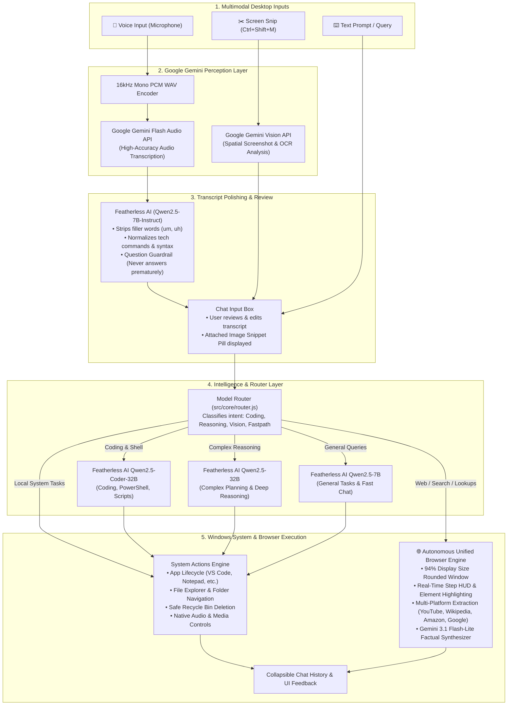

# FahOS — AI Operating Layer for Windows

<div align="center">


**Desktop Intelligence • Multimodal Vision • Voice Processing • Native Windows Integration**

[](https://microsoft.com/windows)
[](https://electronjs.org)
[](https://featherless.ai)
[](https://aistudio.google.com)
[](ARCHITECTURE.md)
[](LICENSE)

</div>

---

## 🌟 Overview

**FahOS** is an intelligent, floating spatial AI operating layer for Windows. Designed with an ultra-sleek translucent glassmorphism HUD, FahOS seamlessly fuses **Google Gemini**'s multimodal perception (vision & high-fidelity audio transcription) with **Featherless AI**'s specialized open-source model cluster (`Qwen2.5-Coder-32B`, `Qwen2.5-32B`, `Qwen2.5-7B`) to control your desktop, analyze your screen, execute system automation, and handle complex queries.

---

## 🔄 Total Workflow: How Featherless AI and Google Work Together

FahOS adopts a specialized multi-engine architecture where each AI engine excels at its core strength. Detailed technical specifications, data models, and sequence flows are documented in **[ARCHITECTURE.md](ARCHITECTURE.md)**.



### 1. The Voice Pipeline (Option 2 Architecture)
- **Audio Capture**: Captures microphone audio using the HTML5 `MediaRecorder` API and converts it into a high-fidelity 16kHz mono 16-bit PCM WAV stream.
- **Speech-to-Text**: Transcribes audio using **Google Gemini Flash Audio** (with automatic fallback to Groq Whisper if configured) for unmatched transcription accuracy.
- **Transcript Polishing**: The raw transcript passes through **Featherless AI (`Qwen2.5-7B-Instruct`)** with a few-shot normalization prompt. It eliminates vocal hesitations (`um`, `uh`, `like`), fixes tech terms (`"power shell"` → `PowerShell`, `"git commit minus m"` → `git commit -m`), while enforcing strict **Question Guardrails** so questions are never answered prematurely.
- **Human-in-the-Loop Review**: The cleaned prompt populates the input field, allowing the user to review, edit, or adjust before sending manually.

### 2. The Vision & Screen Snip Pipeline
- **Interactive Region Capture (`Ctrl+Shift+M`)**: An ultra-responsive desktop overlay allows clicking and dragging to snip any area of the screen.
- **Attachment Pill Badge**: The snip instantly appears inside the prompt bubble as an emerald glassmorphism pill badge (`[ 🖼️ Thumbnail | Snipped Region | ✕ ]`), while setting the placeholder to `"Ask a question about this snip, or press Enter/Send..."`.
- **Visual Understanding**: **Google Gemini Vision** ingests the base64 screenshot to read code, extract text, debug error dialogues, or analyze graphics.

### 3. The Orchestration & Execution Layer
- **Featherless Model Router**: Dynamic classification matches prompts to specialized open weights:
  - `Qwen/Qwen2.5-Coder-32B-Instruct` for PowerShell commands, scripts, and programming tasks.
  - `Qwen/Qwen2.5-32B-Instruct` for heavy reasoning, multi-step problem solving, and analysis.
  - `Qwen/Qwen2.5-7B-Instruct` for rapid conversational responses and formatting.
- **System Actions**: Directly launches native Windows applications, opens file directories, runs searches, and controls media.

### 4. Autonomous Unified Browser Engine
- **94% Large-Screen Viewport**: Opens in a dedicated 94% display width window (`agentBrowserWindow.js`) with an interactive real-time Step HUD.
- **Autonomous Navigation**: Automatically identifies target platforms (YouTube, Google, Wikipedia, Amazon, GitHub, Reddit), highlights search bars in amber, types queries, and navigates results.
- **Factual Extraction**: Highlights top results in emerald and leverages **Gemini 3.1 Flash-Lite** to extract exact factual answers directly from live page text.
- **Full Architecture Blueprint**: Read the comprehensive component and sequence diagrams in **[ARCHITECTURE.md](ARCHITECTURE.md)**.

---

## ✨ Features

- 💎 **Spatial Glassmorphism HUD**: Floating translucent interface that stays out of your way and summons instantly.
- 🌐 **Autonomous Unified Web Browser**:
  - 94% display size spacious window with vertical-locked geometry.
  - Live frosted glass Step HUD with dynamic domain badges (`GOOGLE.COM`, `YOUTUBE.COM`, `AMAZON.IN`, `WIKIPEDIA.ORG`).
  - Active model badge (`⚡ GEMINI 3.1 FLASH-LITE`).
  - Real-time DOM element highlighting (search bars, top result cards).
  - Multi-platform extraction: video channels, view counts, product prices, ratings, and Wikipedia summaries.
- 🎙️ **Voice Processing**: One-click recording with real-time waveform animation, Gemini audio transcription, and Featherless AI transcript cleanup.
- 🖼️ **Attached Image Snippet Pill**: Snips attach cleanly inside the chat box with live preview thumbnails and instant removal.
- ⚡ **Fastpath System Automation**:
  - **Windows Command Engine**: Direct execution for native CLI & PowerShell commands (`whoami`, `ipconfig`, `tasklist`, etc.).
  - **App Lifecycle**: Launch & close apps (VS Code, Notepad, Chrome, Windows Terminal, Calculator, File Explorer).
  - **Smart Verification**: Checks local Windows environment first, falls back to web apps/browser, or clearly informs the user if not openable.
  - **Safe File & Directory Operations**: Creates files/folders and sends deleted items safely to the **Windows Recycle Bin**.
  - **Web & Media**: Instant YouTube searches, Spotify playback, web lookups, and Gmail compose.
  - **Files**: One-command navigation to Desktop, Downloads, Documents, and custom drives.
- 📜 **Collapsible History Cards**:
  - History view automatically collapses long answers (>130 characters / multi-line) to a clean 72px card with a smooth bottom fade gradient mask.
  - Interactive **Show More ▾** and **Show Less ▴** toggle buttons.
  - One-click copy response to clipboard.
- 📇 **Phonebook & Diagnostics**: Quick-access drawer for saved actions, prompt shortcuts, and status monitoring.

---

## 📂 Project Structure

The project is structured logically into modular layers:

```
FahOS/
├── ARCHITECTURE.md                  # Comprehensive system architecture & sequence blueprint
├── README.md                        # Project documentation & quickstart
├── package.json                     # Electron & project manifest
├── .env.example                     # Example environment configuration
│
├── browser-service/                 # Optional Python FastAPI Playwright microservice (:8484)
│   ├── main.py                      # FastAPI server endpoints
│   ├── agent.py                     # Playwright & browser-use autonomous logic
│   ├── browser_manager.py           # Chromium instance manager
│   ├── task_manager.py              # Background task lifecycle manager
│   └── start.bat                    # Microservice launcher
│
└── src/
    ├── agent/
    │   └── agent.js                 # Central AgentEngine orchestrator
    │
    ├── core/
    │   ├── featherless.js           # Featherless AI client (Qwen 2.5 cluster)
    │   ├── router.js                # ModelRouter & 0ms fast-path intent classifier
    │   ├── system_actions.js        # Native Windows OS actions (app execution, folders, media)
    │   ├── vision_sensor.js         # Google Gemini vision sensor for analyzing snips
    │   └── voice_service.js         # Audio transcription (Gemini) + Featherless transcript refiner
    │
    ├── main/
    │   ├── main.js                  # Electron main process (window management, shortcuts, IPC handlers)
    │   ├── preload.js               # Secure contextBridge API exposing window.fahosAPI
    │   └── features/
    │       ├── browser/
    │       │   ├── agentBrowserWindow.js     # 94% large-screen window manager & IPC
    │       │   ├── agentBrowserController.js # Autonomous navigation & Gemini 3.1 extraction
    │       │   └── agentBrowserPreload.js    # Webview isolation bridge
    │       └── system/
    │           └── systemActions.js          # Extended Windows automation engine
    │
    └── renderer/
        ├── index.html               # Floating HUD main interface
        ├── styles.css               # Glassmorphism styling, animations, history collapse masks
        ├── app.js                   # Main UI logic (chat, voice recording, snip pill, history toggle)
        ├── snip.html / .css / .js   # Screen snipping overlay
        └── browser/
            ├── agentBrowser.html    # Autonomous browser viewport & HUD layout
            ├── agentBrowser.css     # Large-screen HUD styling & emerald badges
            └── agentBrowser.js      # Browser HUD controller & step listeners
```

---

## ⌨️ Keyboard Shortcuts

| Shortcut | Action |
| :--- | :--- |
| <kbd>Ctrl</kbd> + <kbd>Space</kbd> | Toggle / Summon FahOS HUD |
| <kbd>Ctrl</kbd> + <kbd>Shift</kbd> + <kbd>M</kbd> | Launch Interactive Screen Snipping Tool |
| <kbd>Esc</kbd> | Minimize / Dismiss HUD or cancel snipping |
| <kbd>Enter</kbd> | Send message / execute command |
| <kbd>Shift</kbd> + <kbd>Enter</kbd> | Insert newline in chat prompt |

---

## 🚀 Getting Started

### Prerequisites
- **Node.js**: v18.0.0 or higher
- **Operating System**: Windows 10 or Windows 11

### 1. Clone & Install
```bash
git clone https://github.com/agasthya2006/FahOS.git
cd FahOS
npm install
```

### 2. Configure Environment Keys
Create a `.env` file in the root directory:
```env
# Featherless AI API Key (required for reasoning, coding, and transcript refining)
# Get yours from: https://featherless.ai
FEATHERLESS_API_KEY=your_featherless_api_key_here

# Google Gemini API Key (required for vision analysis and voice audio transcription)
# Get yours from: https://aistudio.google.com
GEMINI_API_KEY=your_gemini_api_key_here
```

### 3. Launch FahOS
```bash
npm start
```
*Or for live development:*
```bash
npm run dev
```

---

## 🔒 Security & Privacy
- **API Keys**: Stored locally in `.env` and never tracked by Git.
- **Local Audio Processing**: Audio is encoded directly on-device into 16kHz PCM WAV before transcription.
- **Process Isolation**: Electron IPC strictly mediated through `contextBridge` with `contextIsolation: true` and `nodeIntegration: false`.

---

## 📄 License
This project is licensed under the MIT License — see the [LICENSE](LICENSE) file for details.

