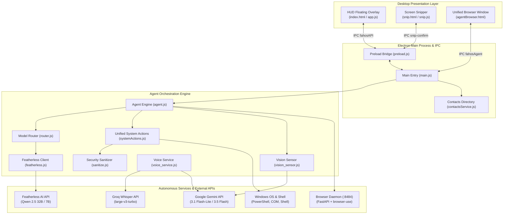

<div align="center">


# ✦ FahOS ✦
### Native Windows AI Operating Layer & Autonomous Desktop Agent
*See → Understand → Act → Verify*

[](https://microsoft.com/windows)
[](https://www.electronjs.org/)
[](https://nodejs.org/)
[](https://python.org/)
[-EA4335?style=flat-square&logo=google-slides&logoColor=white)](https://docs.google.com/presentation/d/1_snMZsUheySffuCqZokMO4uP_4ONn5ZR/edit?usp=sharing&rtpof=true&sd=true)
[](LICENSE)

<br/>

**📊 [Click here to view the Project Presentation (PPT)](https://docs.google.com/presentation/d/1_snMZsUheySffuCqZokMO4uP_4ONn5ZR/edit?usp=sharing&rtpof=true&sd=true)**

</div>

---

## 1. What is FahOS?

**FahOS** is an autonomous desktop operating layer for Windows that integrates ambient artificial intelligence into everyday computing. Operating as a frameless, transparent glassmorphism HUD, FahOS allows users to interact with their system through text, voice, or screen snipping.

Unlike generic chatbots, FahOS is directly wired to the operating system:
- **0ms Intent Fast-Paths**: Instantly launches apps, navigates directories, adjusts volume, manages media, opens Spotify, or launches WhatsApp/Gmail deep-links without making external LLM calls.
- **Vision-Aware**: Snips screen areas and analyzes code errors, UI layouts, and diagrams using Google Gemini multimodal vision.
- **Autonomous Web Navigation**: Executes browser tasks (on YouTube, Wikipedia, Amazon, Google) inside a dedicated 94% display size viewport using Playwright and Chromium.
- **Deep Reasoning**: Routes complex queries to Featherless AI (Qwen 2.5 32B / 7B) with deterministic intent routing and error recovery.

---

## 2. Technology Stack

| Layer / Subsystem | Technology | Version / Model | Role in FahOS |
|---|---|---|---|
| **Desktop Application Framework** | [Electron](https://www.electronjs.org/) | `^31.0.0` | Cross-platform desktop runtime, multi-window lifecycle management, transparent frameless HUD overlay, secure IPC bridges |
| **Frontend & Presentation** | Vanilla JavaScript (ES6+), HTML5, CSS3 | Native Web Standards | Zero-dependency glassmorphism UI, CSS custom property design tokens, dynamic DOM manipulation, interactive waveform animations |
| **Screen Snipping Engine** | HTML5 Canvas API + `desktopCapturer` | Native Electron API | Screen area selection, crosshair coordinate tracking, region cropping, and JPEG downscaling for visual analysis |
| **Core Orchestration & Runtime** | [Node.js](https://nodejs.org/) | `>=18.0.0` | Main process business logic, intent routing engine, security argument escaping, and local OS bridge |
| **Primary AI Reasoning Engine** | [Featherless AI](https://featherless.ai/) | `Qwen/Qwen2.5-32B-Instruct` | Deep multi-step task reasoning, strategic planning, and complex conversational problem-solving |
| **Coding & Script Synthesis** | [Featherless AI](https://featherless.ai/) | `Qwen/Qwen2.5-Coder-32B-Instruct` | Specialized generation of verified PowerShell automation scripts and technical code snippets |
| **Fast Conversational Chat** | [Featherless AI](https://featherless.ai/) | `Qwen/Qwen2.5-7B-Instruct` | High-speed, low-latency conversational responses for short queries (≤ 8 words) |
| **Multimodal Vision Sensor** | [Google Gemini API](https://ai.google.dev/) | `gemini-3.5-flash` / `gemini-3.6-flash` | Visual screen capture analysis, code error diagnosis, diagram interpretation, and UI inspection |
| **Speech-to-Text Transcription** | [Groq Cloud API](https://groq.com/) | `whisper-large-v3-turbo` | Ultra-fast cloud speech recognition for spoken natural language commands |
| **Voice Processing & WAV Encoder** | Web Audio API + `MediaRecorder` | 16kHz Mono PCM WAV | In-browser audio recording, floating-point to 16-bit PCM conversion, and Featherless conversational filler cleanup |
| **Autonomous Web Microservice** | [FastAPI](https://fastapi.tiangolo.com/) + [Uvicorn](https://www.uvicorn.org/) | Python 3.10+ / FastAPI `>=0.110.0` | Asynchronous local background daemon (`http://127.0.0.1:8484`) managing autonomous browser tasks |
| **Autonomous Browser Engine** | [browser-use](https://github.com/browser-use/browser-use) + [Playwright](https://playwright.dev/) | Chromium Automation | Automated browser navigation, visual DOM element highlighting (search bars, cards), and multi-platform extraction |
| **In-Browser Webpage Synthesizer** | [Google Gemini API](https://ai.google.dev/) | `gemini-3.1-flash-lite` | Real-time extraction and factual synthesis directly from rendered webpage DOM text |
| **Data Schema & Model Validation** | [Pydantic](https://docs.pydantic.dev/) | `^2.6.0` (v2) | Strict schema validation, type enforcement, and serialization for browser task APIs |
| **Native Operating System Shell** | Windows PowerShell + .NET CLI | PowerShell 5.1+ / Windows 10 & 11 | Direct process execution, application launching, task termination (`taskkill`), and system status checks |
| **Hardware & Media Automation** | Windows Script Host (`WScript.Shell`) | Windows COM Automation | Native master volume step control, mute toggle, media play/pause, next/previous track, and workstation locking |
| **Recycle Bin Safe Deleter** | Microsoft VisualBasic FileIO | `Microsoft.VisualBasic.dll` | Non-destructive file and folder deletions routed safely to the Windows Recycle Bin |
| **OS Protocol Deep-Linking** | Electron `shell.openExternal` | Windows URI Protocol Handlers | Direct native application launching for `whatsapp://`, `spotify:`, `ms-settings:`, and Gmail web compose |
| **Local Data Persistence** | Local-First JSON + `localStorage` | Flat JSON Files | Offline-first storage for Directory Mode contacts (`fahos_contacts.json`) and searchable chat history |
| **Security & Sanitization** | Custom Sanitization Layer | FahOS `sanitize.js` | Strict single-quote shell escaping (`sanitizePowerShellArg`), path traversal protection (`sanitizeFileName`), and CSP |

---

## 3. System Architecture



---

## 4. Discovered Capabilities & Implementation Status

| Feature | Category | Status | Description |
|---------|----------|--------|-------------|
| **Floating Glassmorphism HUD** | UI / Desktop | `Implemented` | Minimalist, always-on-top overlay with live status and history |
| **Intent Classifier & Router** | AI / Routing | `Implemented` | Deterministic regex-based classification routing to fast-paths or models |
| **Featherless Multi-Model LLM** | AI / Reasoning | `Implemented` | Qwen 2.5 32B (complex), Qwen 2.5 Coder 32B, Qwen 2.5 7B (simple) |
| **Multimodal Vision Sensor** | AI / Vision | `Implemented` | Screen analysis using Google Gemini 3.5 Flash / 3.6 Flash |
| **Voice-to-Text Pipeline** | AI / Speech | `Implemented` | Audio recording with Groq Whisper Large-v3-Turbo + transcript refiner |
| **Screen Snipping Tool** | Capture / UI | `Implemented` | Canvas-based rectangular screen capture attached directly to chat prompts |
| **PowerShell Command Executor** | OS Automation | `Implemented` | Native command execution with strict single-quote parameter sanitization |
| **Levenshtein Fuzzy App Opener** | OS Automation | `Implemented` | Resolves misspelled app names (e.g., "notepd" → Notepad) |
| **Windows Directory Navigator** | OS Automation | `Implemented` | Opens Desktop, Downloads, Documents, Pictures, Music, and Videos |
| **Hardware Volume & Media Controls** | OS Automation | `Implemented` | Volume up/down, mute toggle, play/pause, skip track, lock workstation |
| **Spotify Search & Play** | Media Integration | `Implemented` | Direct Spotify URI protocol launcher (`spotify:search:...`) |
| **Web Search & YouTube Scraper** | Web Integration | `Implemented` | Scrapes top YouTube video ID and opens direct playback in browser |
| **WhatsApp Directory Deep-Link** | Messaging | `Implemented` | Resolves contacts and opens `whatsapp://send?phone=...&text=...` |
| **Gmail Web Compose Deep-Link** | Email | `Implemented` | Resolves contact email and opens Gmail compose interface |
| **Notepad Quick Note** | Productivity | `Implemented` | Appends timestamped entries to Desktop `FahOS_Notes.txt` |
| **Safe File/Folder Creator** | File System | `Implemented` | Creates files or directories with sanitized filenames and auto-extension |
| **Recycle Bin Safe Deleter** | File System | `Implemented` | Moves files to Windows Recycle Bin via Microsoft.VisualBasic API |
| **Process Terminator & App Closer**| OS Automation | `Implemented` | Closes processes with status validation (`taskkill /F /IM`) |
| **Unified Autonomous Browser** | Web Automation | `Implemented` | 94% screen viewport for automated navigation via Gemini 3.1 Flash-Lite |
| **Python Browser Microservice** | Microservice | `Implemented` | FastAPI server at `127.0.0.1:8484` with Playwright & browser-use |
| **Contacts / Phonebook CRUD** | Local Data | `Implemented` | Local-first JSON contact storage with 1-click WhatsApp and Email buttons |
| **Chat History Storage** | Local Data | `Implemented` | Persistent localStorage history with collapsible cards and copy actions |
| **Window Dragging & Resizing** | Window Management| `Implemented` | Header-based dragging and interactive vertical resize handle |
| **Streaming Token Display** | AI / Streaming | `Partial` | SSE streaming generator implemented; UI buffering is planned |
| **Cross-Platform OS Support** | Multi-OS | `Planned` | Native Linux and macOS adapters planned for future releases |

---

## 5. Installation & Getting Started

### Prerequisites
- **Windows 10 or 11 (64-bit)**
- **Node.js 18.0.0 or higher**
- **Python 3.10+** (optional, required for the autonomous browser microservice)

### Step 1: Clone Repository
```bash
git clone https://github.com/agasthya2006/FahOS.git
cd FahOS
```

### Step 2: Install Node Dependencies
```bash
npm install
```

### Step 3: Configure Environment Variables
Copy `.env.example` to `.env`:
```bash
copy .env.example .env
```

Provide your API keys in `.env`:
```env
# Primary LLM API (Featherless AI)
FEATHERLESS_API_KEY=your_featherless_api_key

# Google Gemini API (Vision & Autonomous Browser)
GEMINI_API_KEY=your_gemini_api_key

# Optional: Groq Whisper for voice transcription
GROQ_API_KEY=your_groq_api_key
```

### Step 4: Setup Python Browser Microservice (Optional)
```bash
cd browser-service
python -m venv venv
.\venv\Scripts\activate
pip install -r requirements.txt
playwright install chromium
cd ..
```

### Step 5: Start FahOS
```bash
npm start
```

---

## 6. Keyboard Shortcuts

| Shortcut | Action |
|---|---|
| `Ctrl + Space` or `Alt + Space` | Toggle FahOS HUD Overlay (Show / Hide) |
| `Ctrl + Shift + M` | Trigger Screen Snipping Tool |
| `Enter` | Send message / Confirm snip selection |
| `Esc` | Cancel snip selection / Dismiss modal |

---

## 7. Example Natural Language Workflows

### Operating System Controls (0ms Fast-Path)
- `"open notepad and note down grocery list"`
- `"increase volume"` or `"mute"`
- `"lock screen"` or `"lock pc"`
- `"open downloads"` or `"go to documents"`
- `"close chrome"` or `"quit calculator"`
- `"create a file named project_notes.txt on Desktop"`
- `"delete file old_draft.txt from Desktop"`

### Messaging & Contacts
- `"open whatsapp and send hi to akhil"`
- `"send email to john with subject meeting notes"`
- Click the droplet menu in the HUD to open **Directory Mode** and manage contacts.

### Vision & Screen Understanding
- Press `Ctrl + Shift + M` or click the Snipper icon.
- Select any code error, UI element, or chart on your screen.
- Ask: `"What is causing this error and how do I fix it?"`

### Autonomous Browser Navigation
- `"search youtube for lofi hip hop beats"`
- `"go to wikipedia and summarize quantum computing"`
- `"search amazon for wireless mechanical keyboards"`

---

## 8. Security & Protection Model

1. **PowerShell Argument Sanitization**: All shell parameters are strictly escaped using `sanitizePowerShellArg()` in `src/core/sanitize.js`, using single-quote literals to block variable expansion, subexpressions, and command chaining.
2. **Safe Deletions**: File deletions are safely transferred to the Windows Recycle Bin using Microsoft VisualBasic FileIO rather than executing permanent disk removals.
3. **Execution Guard on AI Outputs**: LLM-generated code blocks cannot invoke format, partition, or destructive commands without explicit confirmation.
4. **Content Security Policy (CSP)**: Enforced across all Electron windows (`index.html`, `snip.html`, `agentBrowser.html`).
5. **Localhost Network Boundary**: Python microservice CORS is restricted strictly to local loopback origins (`127.0.0.1` and `localhost`).

---

## 9. Repository Structure

```
FahOS/
├── browser-service/               # Autonomous Playwright microservice (Python FastAPI)
│   ├── agent.py                   # browser-use task execution & Chromium controller
│   ├── browser_manager.py         # Real Chrome profile & window foregrounding
│   ├── config.py                  # Environment config loader
│   ├── main.py                    # REST API endpoints (:8484)
│   ├── requirements.txt           # Python package requirements
│   ├── schemas.py                 # Pydantic request/response schemas
│   ├── start.bat                  # Microservice launcher
│   └── task_manager.py            # Bounded task manager & concurrency lock
├── docs/                          # Detailed technical documentation
│   ├── architecture.md            # System topology & subsystem blueprints
│   ├── features.md                # 25-feature inventory and profiles
│   ├── workflows.md               # Sequence diagrams & execution chains
│   ├── installation.md            # Clean-machine setup guide
│   ├── security.md                # Threat model & protection boundaries
│   └── scaling.md                 # Scalability analysis & roadmap
├── src/
│   ├── agent/
│   │   └── agent.js               # Central Agent Engine & orchestration
│   ├── core/
│   │   ├── featherless.js         # Featherless AI client (Qwen 2.5 models)
│   │   ├── router.js              # Intent classifier & model routing engine
│   │   ├── sanitize.js            # PowerShell & HTML security sanitizer
│   │   ├── system_actions.js      # Core system actions bridge
│   │   ├── vision_sensor.js       # Gemini multimodal vision sensor
│   │   └── voice_service.js       # Groq Whisper & Gemini speech pipeline
│   ├── main/
│   │   ├── features/
│   │   │   ├── browser/           # Autonomous browser Electron integration
│   │   │   │   ├── agentBrowserController.js  # DOM query & Gemini synthesizer
│   │   │   │   ├── agentBrowserPreload.js     # Browser window preload bridge
│   │   │   │   ├── agentBrowserWindow.js      # 94% viewport Electron window
│   │   │   │   └── browserService.js          # HTTP client for Python microservice
│   │   │   ├── contacts/
│   │   │   │   └── contactsService.js         # Local contacts store & phonebook
│   │   │   └── system/
│   │   │       └── systemActions.js           # Unified Windows OS automation
│   │   ├── main.js                # Electron main entry, windows, & IPC handlers
│   │   └── preload.js             # Context bridge for renderer
│   └── renderer/
│       ├── assets/                # Application logos & icons
│       ├── browser/               # Autonomous browser UI
│       │   ├── agentBrowser.css   # Browser window styling
│       │   ├── agentBrowser.html  # Browser window markup
│       │   └── agentBrowser.js    # Browser window frontend controller
│       ├── shared/
│       │   └── theme.css          # Design system tokens (colors, typography)
│       ├── app.js                 # HUD frontend controller & voice encoder
│       ├── index.html             # HUD overlay window markup
│       ├── snip.css               # Screen snipper styling
│       ├── snip.html              # Screen snipper markup
│       ├── snip.js                # Canvas drag-and-drop selector
│       └── styles.css             # Glassmorphism design system
├── .env.example                   # Environment variable template
├── .gitignore                     # Git ignore rules
├── CHANGELOG.md                   # Version changelog
├── CONTRIBUTING.md                # Contribution guidelines
├── LICENSE                        # MIT License
├── package.json                   # Project manifest & scripts
└── README.md                      # Project documentation
```

---

## 10. Verification & Testing

Run the syntax and integrity test suite:
```bash
npm test
```

To run individual module verifications:
```bash
node -c src/main/main.js
node -c src/core/router.js
node -c src/main/features/system/systemActions.js
```

---

## 11. Acknowledgements & Special Dedication

> ### 🚀 Special Dedication
> **This project is specially made for : Hackwave 3.0**
> 
> 📊 **Project Presentation (PPT)**: [View Presentation on Google Slides](https://docs.google.com/presentation/d/1_snMZsUheySffuCqZokMO4uP_4ONn5ZR/edit?usp=sharing&rtpof=true&sd=true)
