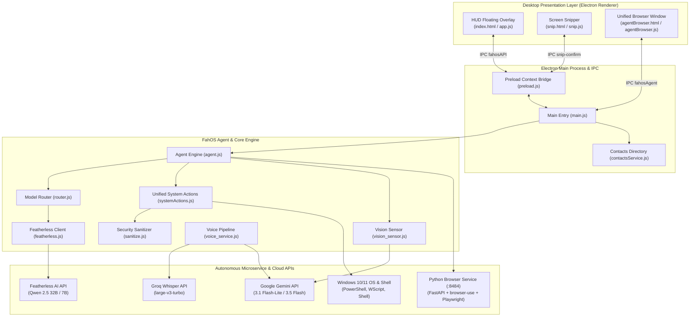

# FahOS — System Architecture & Technical Blueprint

## 1. Executive Summary

**FahOS** is an autonomous desktop operating layer for Windows that integrates ambient AI into everyday desktop workflows. Built with an Electron desktop frontend, a Node.js orchestration engine, and an autonomous Playwright/browser-use Python microservice, FahOS bridges high-level user intent (via text, voice, or screen capture) to concrete OS and browser actions:

$$\text{User Intent} \xrightarrow{\text{Classify \& Route}} \begin{cases} \text{Fast-Path (0ms LLM)} & \to \text{Windows Shell / PowerShell / Protocol} \\ \text{Vision Sensor} & \to \text{Google Gemini Multimodal Analysis} \\ \text{Deep Reasoning} & \to \text{Featherless AI (Qwen 2.5 32B/7B)} \\ \text{Web Task} & \to \text{FahOS Autonomous Browser (94\% View)} \end{cases}$$

---

## 2. System Topology



---

## 3. Subsystem Architecture

### 3.1. Desktop Presentation Layer
- **HUD Floating Overlay (`src/renderer/index.html`)**: Glassmorphism widget with interactive chat, live status indicator, voice input controller, directory manager, and history cards.
- **Screen Snipper (`src/renderer/snip.html`)**: Canvas-driven selection interface with dimension badges and preview cropping.
- **Unified Browser (`src/renderer/browser/agentBrowser.html`)**: 94% screen viewport with integrated status banner, step pills, live webview, and task control.

### 3.2. Orchestration & Routing Layer
- **Model Router (`src/core/router.js`)**: Evaluates incoming queries using deterministic intent classification before delegating to LLMs. Fast-paths execute in 0ms without consuming token quota.
- **Agent Engine (`src/agent/agent.js`)**: Coordinates context assembly, status emission, action execution, and error recovery.

### 3.3. OS Automation Engine
- **Unified System Actions (`src/main/features/system/systemActions.js`)**: Executes desktop actions through sanitized PowerShell invocations, Windows COM automation (`WScript.Shell`), Electron shell protocols (`whatsapp://`, `spotify:`), and native file system operations.
- **Security Sanitization (`src/core/sanitize.js`)**: Hardened parameter escaping to prevent command injection, traversal attacks, and XSS.

### 3.4. Autonomous Web Browser Microservice
- **Python Daemon (`browser-service/`)**: FastAPI server running on `127.0.0.1:8484` backed by `browser-use`, Playwright Chromium automation, and Gemini 3.1 Flash-Lite for web extraction.

---

## 4. Model Routing Decision Tree

```
User Input Received
       │
       ├─► Has Screenshot / Visual Keyword? ──────────────► Gemini 3.5 Flash / Qwen 2.5 VL
       ├─► Matches Windows CLI Pattern? ──────────────────► Fast-Path: PowerShell Executor
       ├─► Matches Media / Volume Controls? ──────────────► Fast-Path: System Control
       ├─► Matches Spotify Search? ───────────────────────► Fast-Path: Spotify Protocol
       ├─► Matches Web / YouTube / Search Query? ─────────► Fast-Path: Unified Browser Agent
       ├─► Matches Notepad Quick Note? ───────────────────► Fast-Path: Notepad Note Engine
       ├─► Matches WhatsApp Intent? ──────────────────────► Fast-Path: Directory WhatsApp Deep-Link
       ├─► Matches Email Intent? ─────────────────────────► Fast-Path: Gmail Web Compose
       ├─► Matches File / Folder Create / Delete? ────────► Fast-Path: Safe File System Action
       ├─► Matches App Close / Terminate? ────────────────► Fast-Path: Process Terminator
       ├─► Matches App / Folder / URL Open? ──────────────► Fast-Path: Item Verifier & Opener
       ├─► Coding Query? ─────────────────────────────────► Featherless: Qwen 2.5 Coder 32B
       ├─► Short Simple Query (≤8 words)? ────────────────► Featherless: Qwen 2.5 7B Instruct
       └─► Complex Multi-Step Task? ──────────────────────► Featherless: Qwen 2.5 32B Instruct
```

---

## 5. Security Architecture & Trust Boundaries

| Boundary | Protection Mechanism | Enforced At |
|----------|----------------------|-------------|
| **Renderer Process** | Context Isolation enabled, sandbox configured, CSP meta headers | `preload.js`, HTML files |
| **Shell Command Execution** | Strict single-quote escaping via `sanitizePowerShellArg()`, no direct string concatenation | `sanitize.js`, `systemActions.js` |
| **File Operations** | Sanitized filenames, Recycle Bin safe deletion via VisualBasic COM | `systemActions.js` |
| **Browser Daemon** | Localhost-only CORS regex, bounded in-memory store | `main.py`, `task_manager.py` |
| **LLM Output** | Guarded execution; destructive commands blocked automatically | `agent.js` |
