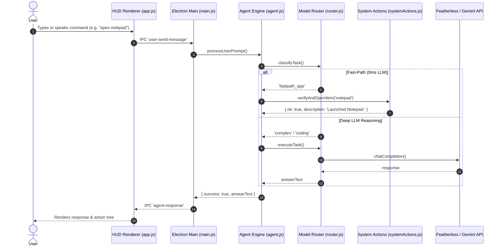
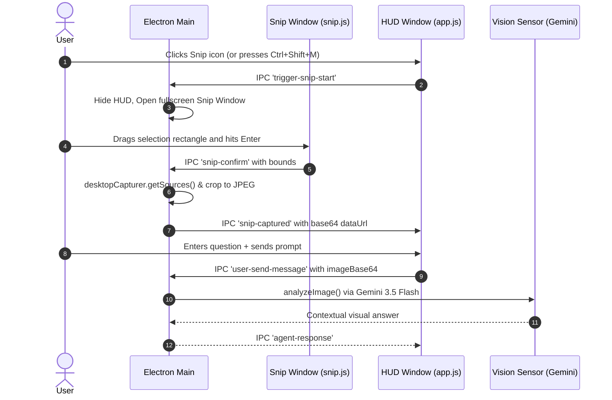
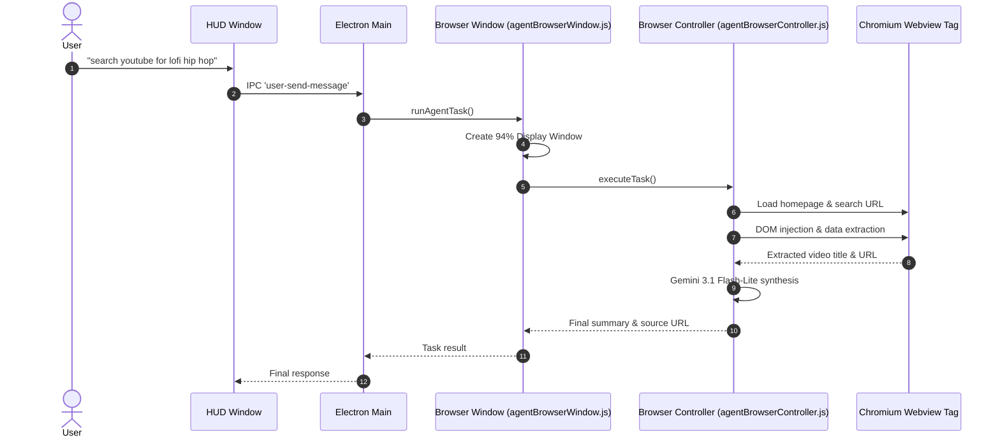
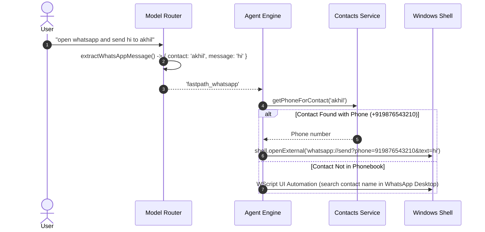

# FahOS — Core Workflows & Execution Chains

This document outlines the operational workflows implemented across FahOS.

---

## 1. Primary Chat & Fast-Path Action Workflow



---

## 2. Screen Snip & Vision Analysis Workflow



---

## 3. Autonomous Web Browser Workflow



---

## 4. WhatsApp & Directory Workflow



---

## 5. Error Recovery & Failure Handling

```
Failure Detected
       │
       ├─► Network / API Error (Featherless 429/503)
       │       └─► Exponential backoff (1200ms-2500ms) up to 3 attempts
       │       └─► Fallback to fast model Qwen 2.5 7B
       │
       ├─► Vision Model Error (404/429)
       │       └─► Cascade: Gemini 3.5 Flash -> 3.6 Flash -> 3 Flash Preview -> Featherless VL
       │
       ├─► Voice Transcription Error
       │       └─► Cascade: Groq Whisper -> Gemini Audio -> Browser Web Speech fallback
       │
       └─► Command / Action Execution Failure
               └─► Safe return { ok: false, error: message } -> User error card with Retry button
```
